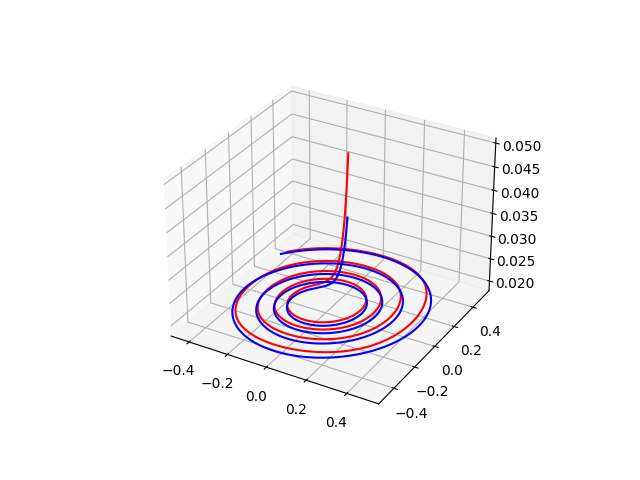
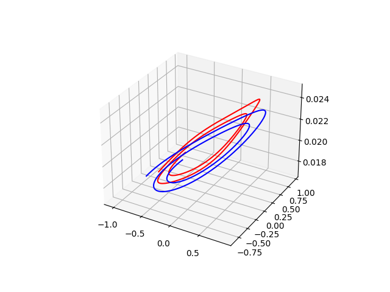
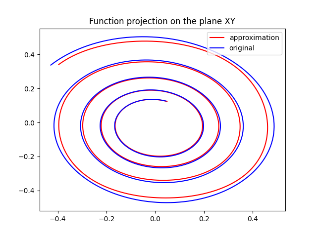
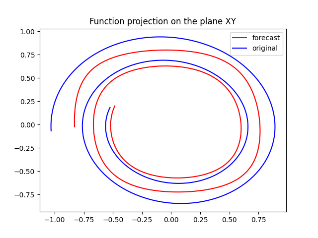
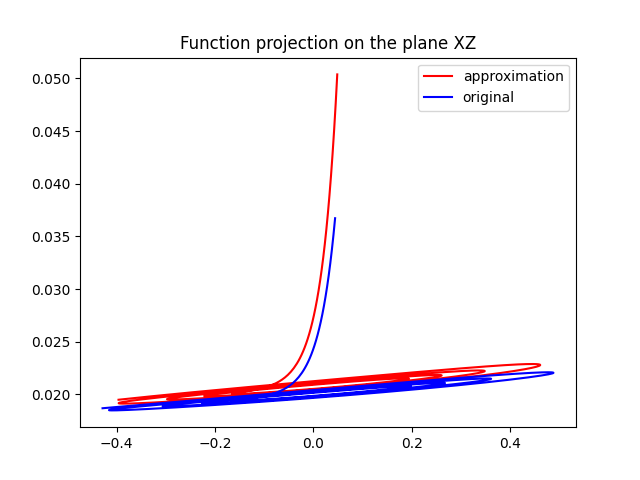
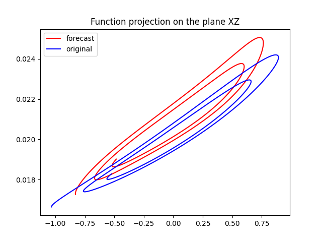
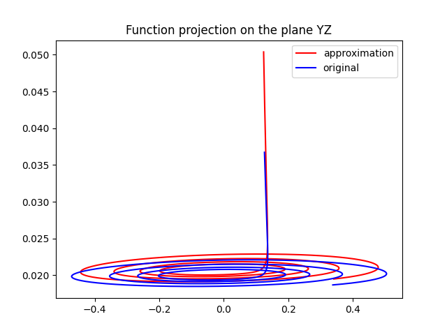
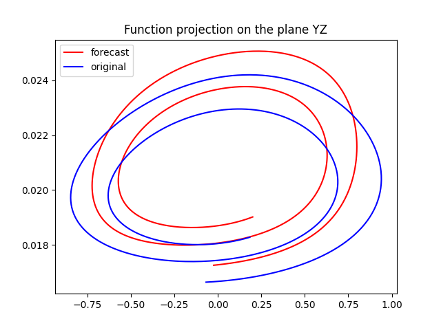

### Multilayer perceptron model with backpropagation learning rule  
Approximates and forecasts functions given as first order ODE systems.    

Network optimization can be achieved by adjusting parameters(alpha, input layer size, hidden layer size and seed for weights and biases random initialization) for a specific function.  
***  
### Example    
ẋ = -y - z  
ẏ = x + 0,1y  
ż = 0,1 + z(x – 5)   

parameters for X: alpha = 0.001, E_min = 0.1, input_size = 16, hidden_size = 50, seed = 67  
parameters for Y: alpha = 0.001, E_min = 0.1, input_size = 16, hidden_size = 50, seed = 67  
parameters for Z: alpha = 0.01, E_min = 0.001, input_size = 16, hidden_size = 50, seed = 67  
| **Approximation** |  **Forecast** |
:-------------------------:|:-------------------------:
   |   
.png) |  .png)
.png) |  .png)
.png) |  .png)  
   |  
   |  
   |  
  